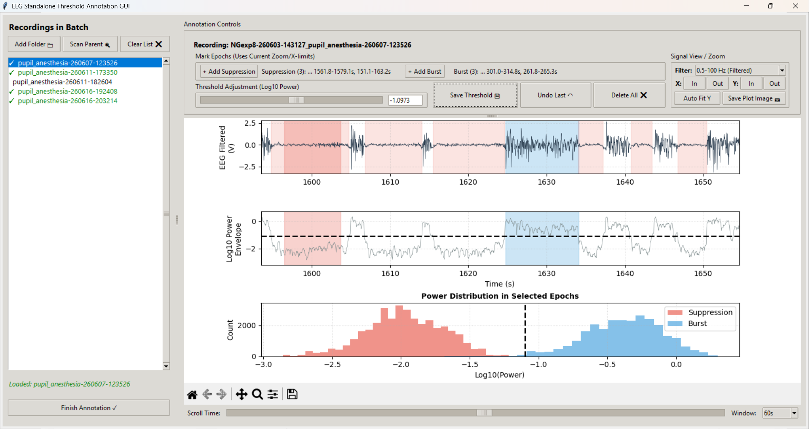

©2026 Noam Gabay, Nir Lab, TAU

# EEG Semi-Automatic Threshold Annotation GUI

This repository contains an interactive Tkinter graphical user interface (GUI) designed for annotating and setting burst-suppression thresholds on continuous EEG recordings.

It reads continuous EEG signal streams directly from Tucker-Davis Technologies (TDT) hardware data blocks, calculates signal power features, and provides visual, statistical, and keyboard-driven tools to determine optimal power threshold boundaries.


Blue: Annotated burst epocs <br>
Dark Red: Annotated suppression epocs <br>
Light Red: Detected suppression epocs <br>

---

## Project Structure

To maintain separation of concerns, the standalone project is split into:

*   [main.py](file:///C:/Users/user/Documents/GitHub/masters-project/pipelines/eeg/eeg_threshold_gui_standalone.py): The main window logic, event handlers, and Tkinter/Matplotlib layout.
*   [eeg_processing.py](file:///C:/Users/user/Documents/GitHub/masters-project/pipelines/eeg/eeg_processing.py): Core digital signal processing (DSP) functions including TDT file loading, polyphase resampling, notch/bandpass filtering, log-envelope calculation, and morphological state heuristics.
*   `requirements.txt`: Python dependencies required to run the tools.
*   `manual_thresholds.json`: Centralized sidecar threshold registry file (optional).

---

## Key Features

### 1. Preprocessing & Signal Pipeline
*   **TDT Reading**: Directly parses raw TDT blocks using the `tdt` SDK (extracting streams under `'rEEG'`).
*   **Clock Normalization**: Resamples the raw signal to a unified $1000\text{ Hz}$ sample rate using polyphase resampling.
*   **Dual Filter Pipeline**: Applies notch filters ($50\text{ Hz}$ and $100\text{ Hz}$) and a $0.5 - 100.0\text{ Hz}$ bandpass Butterworth filter to clear electrical noise.
*   **Log Power Envelope**: Calculates the rolling squared amplitude power ($250\text{ ms}$ window) and transforms it into the logarithmic scale ($\log_{10}(\text{power})$).

### 2. Viewport & Visualization Controls
*   **Filter Mode Selector**: Toggle dynamically between the **0.5-100 Hz (Filtered)** signal and the **Raw EEG** signal in Plot 1.
*   **X-axis (Time) Zooming**: Quick button controls to zoom in (30% reduction) and out (40% expansion) of the active time window.
*   **Y-axis (Amplitude) Zooming**: Quick button controls to zoom in (25% reduction) and out (33% expansion) of the signal amplitude range.
*   **Auto Fit Y**: Instantly scales the Y-axis limits of Plot 1 to tightly fit the minimum and maximum values of the signal currently visible in the active time window (with a 10% vertical padding).
*   **Time Scroll Slider**: Scroll smoothly across the entire duration of the recording.
*   **Window Size Selection**: Set specific viewing windows using preset durations: `1s`, `2s`, `5s`, `10s`, `30s`, `60s`, `120s`, `300s`, `600s`, or `Full`.

### 3. Annotation & Automated Threshold Estimation
*   **Representative Epoch Labeling**:
    *   Find a region of flat, low-amplitude activity and click **+ Add Suppression** to mark the current window limits.
    *   Find a region of high-intensity burst activity and click **+ Add Burst** to mark the current window limits.
*   **Live Power Distributions**: Plots overlapping histograms of the log-power values within marked suppression (red) and burst (blue) zones in Plot 3.
*   **Heuristics-Based Auto-Shading**: Displays real-time red shading spans where the log-power envelope falls below the selected threshold, cleaned up by neurophysiological heuristics (bridging suppression gaps $< 0.5\text{ s}$ and filtering out noise bursts $< 0.1\text{ s}$).
*   **Automated Threshold Proposing**: Instantly calculates a proposed separator threshold as soon as both categories are represented:
    $$\text{Threshold} = \mu_{\text{suppression}} + 0.55 \times (\mu_{\text{burst}} - \mu_{\text{suppression}})$$
*   **Manual Correction**: Adjust the proposed line using the interactive slider or type a value directly into the text field.

### 4. Cohort & Session Management
*   **Add Folder**: Interactively browse and add individual TDT blocks to the active session.
*   **Scan Parent**: Recursively scans a parent folder for any subfolders containing TDT file signatures (`.tbk`, `.tsq`, `.tev`) and adds them to the listbox.
*   **Visual Status Indicators**: Completed recordings are labeled in green with a checklist icon (`✓`), while unannotated folders remain in standard black.
*   **Double-Tier Storage Persistence**:
    *   *Local Sidecar*: Saves metadata directly to `eeg_manual_threshold.json` inside the TDT folder.
    *   *Central Database*: Automatically falls back to a central registry file `manual_thresholds.json` located next to the script.
*   **Delete All**: Deletes all active epoch selections, removes local sidecar configuration files, and deletes entries from the centralized registry database.

### 5. High-Resolution Diagnostic Export
*   Click **Save Plot Image 📷** to export a publication-ready, high-resolution ($300\text{ DPI}$) figure in `PNG` or `PDF` format containing all signal traces, envelopes, annotations, and the histogram.

---

## Installation & Setup

### Prerequisites
*   Python 3.9 or higher is recommended.
*   A Tkinter-supported environment (comes standard with most Python installations; on Linux, you may need `sudo apt-get install python3-tk`).

### Dependencies
Create a `requirements.txt` file with the following packages:
```text
numpy>=1.22.0
pandas>=1.4.0
scipy>=1.8.0
matplotlib>=3.5.0
tdt>=0.6.0
```

Install them using `pip`:
```bash
pip install -r requirements.txt
```

---

## How to Run

You can run the GUI directly from the command line by passing the paths to one or more TDT block folders:

```bash
python eeg_threshold_gui_standalone.py /path/to/TDT_block1 /path/to/TDT_block2
```

Alternatively, you can start the GUI without any arguments and use the **Add Folder 📁** or **Scan Parent 🔍** buttons to load your data:

```bash
python eeg_threshold_gui_standalone.py
```

### Keyboard Shortcuts for Time Navigation
To quickly scan long recordings:
*   `Left Arrow` ($\leftarrow$): Scroll left by 20% of the visible window.
*   `Right Arrow` ($\rightarrow$): Scroll right by 20% of the visible window.
*   `Shift + Left Arrow`: Scroll left by 80% of the visible window.
*   `Shift + Right Arrow`: Scroll right by 80% of the visible window.

---

## JSON Metadata Schema

Annotations are saved in a sidecar JSON format:

```json
{
    "threshold_log": -4.2154,
    "supp_epochs": [
        [12.5, 27.8],
        [104.2, 115.0]
    ],
    "burst_epochs": [
        [45.2, 58.1]
    ],
    "supp_epoch": [12.5, 27.8],
    "burst_epoch": [45.2, 58.1],
    "saved_at": "2026-07-07 11:55:00"
}
```

*   `threshold_log`: The finalized classification threshold (log-power scale).
*   `supp_epochs` / `burst_epochs`: List of start and end times (seconds) of manually annotated training regions.
*   `supp_epoch` / `burst_epoch`: Unwrapped coordinates of the first annotated region (kept for backward compatibility with single-range processors).
*   `saved_at`: Timestamp of the save event.


Made for a Nir Lab MSc. project
©2026 Noam Gabay
